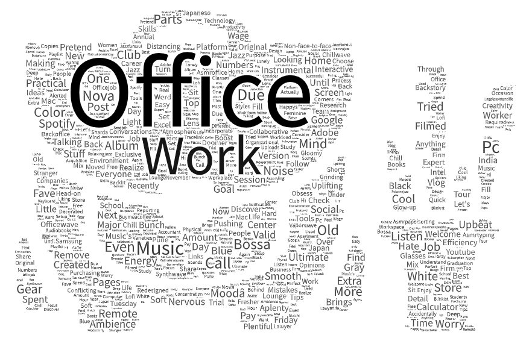
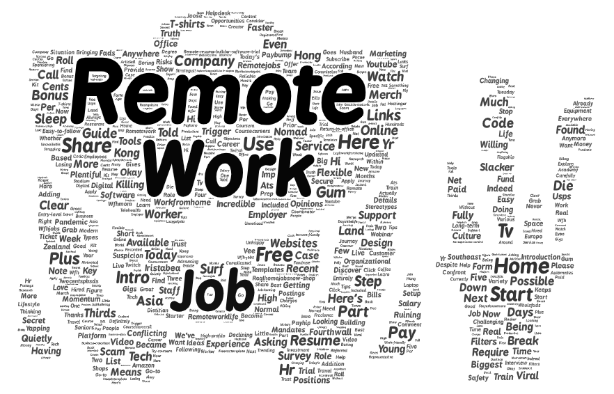

# Lab 2 Web Data Collection and Visualization

## Narrative

The topic I wanted to look into is about the change of workplace locations and how it changes the nature of work. The parameters I used are **Office Work** for OfficeWork.csv and OfficeWorkWordCloud.png, and I used the parameters **Remote Work** for Remote.csv and RemoteWorkWordCloud.png. 

I wanted to make this comparison because I wanted to see what type of reactions these two terms get and how people on youtube discusses about them. These two terms are also getting a lot more popular ever since covid had happen because remote work got extremely popular since then. Some companies have moved over to a hybrid of remote and office work, but some companies have enforced the office workplace. By looking at the words that correlate to these terms, we can see how people positively or negatively view these terms. I also have some opinions on these topics, so I want to see if YouTube reflects the same opinion I have. 

The similarities between the word clouds are that they both have a lot of terms that are similar, like work, home, office, job, and remote. The differences I see between them are that remote work has terms like life, good, remotework, and best while office work has terms like lonely, used, and distancing. These two word clouds do have similarities because they are both discussing work, but the remote work has terms that reflect a more relaxing environment, while the office work reflects terms that reflect more stress or pressure. They both are the same word cloud, so it makes it easier to see the changes and occurrences between them.

The possible reasons I saw the patterns I observed are that people have gotten used to staying home and working from home during covid and when they had to leave their comfy home to go to the office, they disliked it. That doesn't mean that some people don't like going back, some people do enjoy going back to work in the office and benefit from it, but the majority of people liked the change to remote work because they don't have to change into work clothes and commute to work. When they work from home, they can get more sleep and don't have to sit in traffic to get to work. It also causes more flexibility since they can travel more easily. 

How my research could be improved is by adding more terms in my search terms or reducing the amount of extra words in my word map. The words I kept in my word map are important, but if I wanted to hone in on the message more, I could remove some of the more of the terms that don't occur as much or have the same amount of impact as other words do. I can also try to add a location to see how some areas, like office work/ remote work compared to other locations. 

Some things from the map that were different from my expectations were how positive the office work term was. I expected the terms to be more negative and not as positive, but after taking a step back to think about the data, I understood why. Even though many people like working from home, some people like going into the office and talking to their co workers in person and not through a screen. Also, the people making these videos usually have a position in the manager areas, so they want people to go back in the office since its easier to track what they are doing in person. Another thing that stood out to me was that the terms office work and remote work appeared in both word clouds, even though both word clouds didn't have both serach terms.

## Word Cloud 1: Office Work

## Word Cloud 2: Remote Work

## Data Files Created For This Assignment
[Download OfficeWork.csv](assets/OfficeWork.csv)
[Download RemoteWork.csv](assets/RemoteWork.csv)
